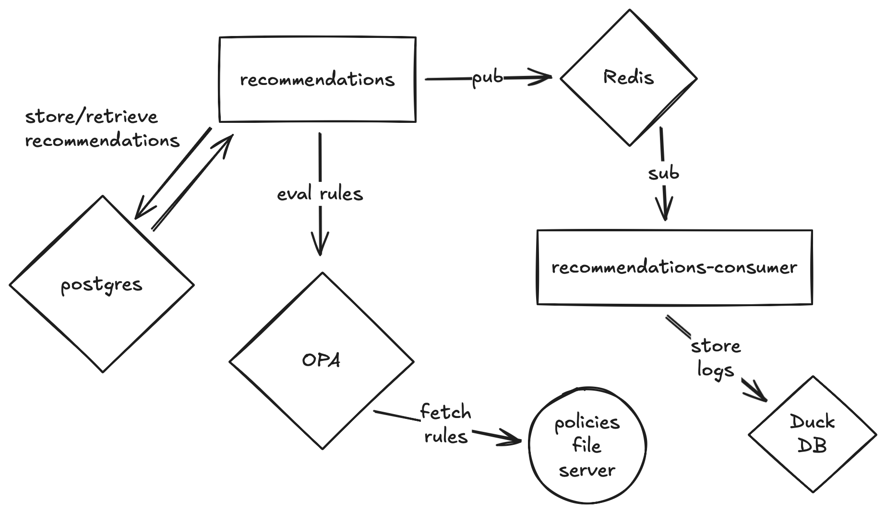

<h1 align="center">Scalable API for Clinical Recommendations with Event-Driven Notifications</h1>

<div align="center">
<p>
A backend service using Python and FastAPI that exposes a RESTful
API to process patient health data and return a clinical recommendation
based on predefined business rules.
</p>
</div>

## Getting Started

Clone the repository:

```bash
git clone https://github.com/dvcorreia/sword-code-challenge.git
```

And to run the services with Docker compose:

```console
docker compose up
```

You should now be able to go to <http://localhost:8000/docs>.


## Architecture Overview



## Work left to do

1. OpenID Connect authorization was giving a weird issue after the authorization code flow (no time to debug further).
2. Caching was not implented due to time contraints, but would be fairly trivial I suspect.
3. Preparing a report and send email/sms was also not done due to time constraints.
4. Tests. Again, no time.